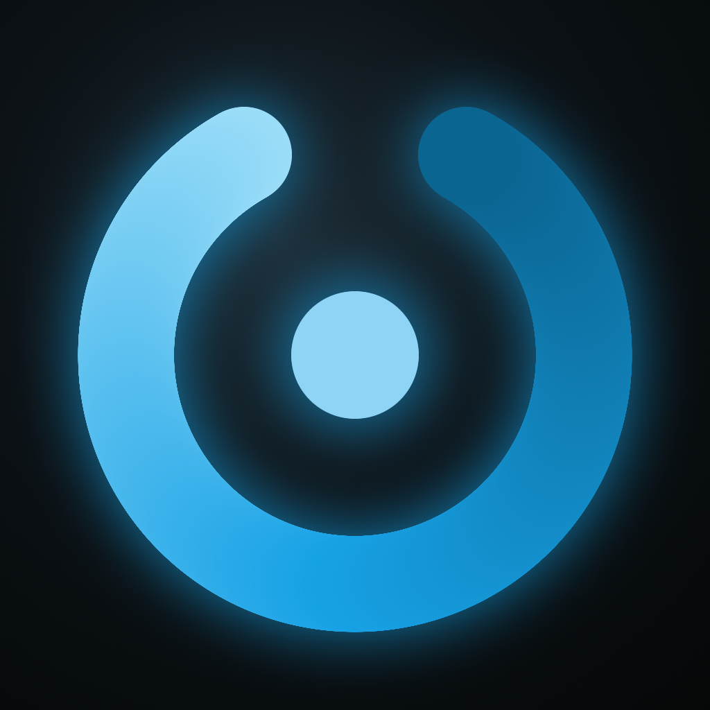
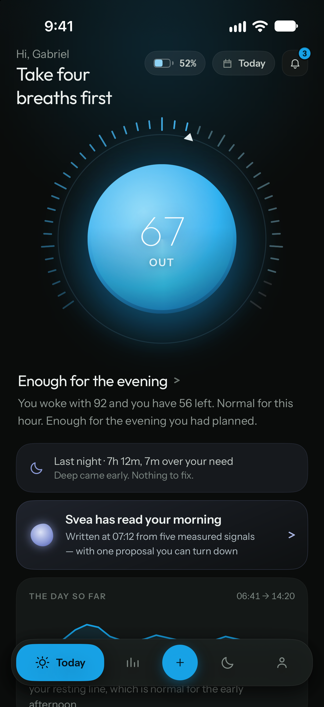
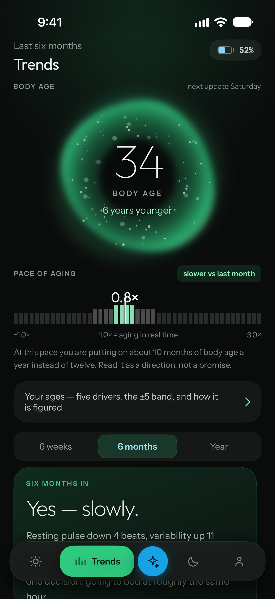
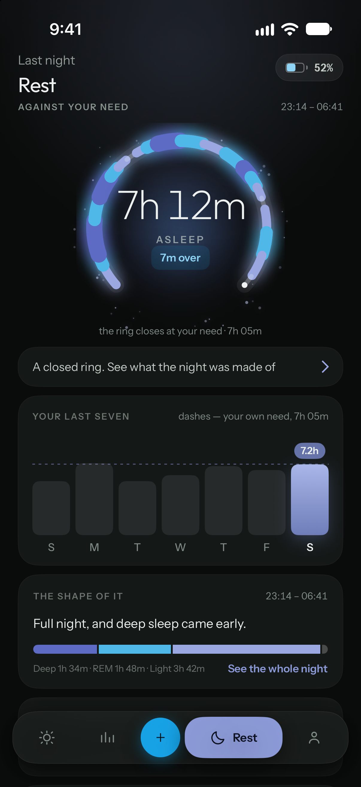
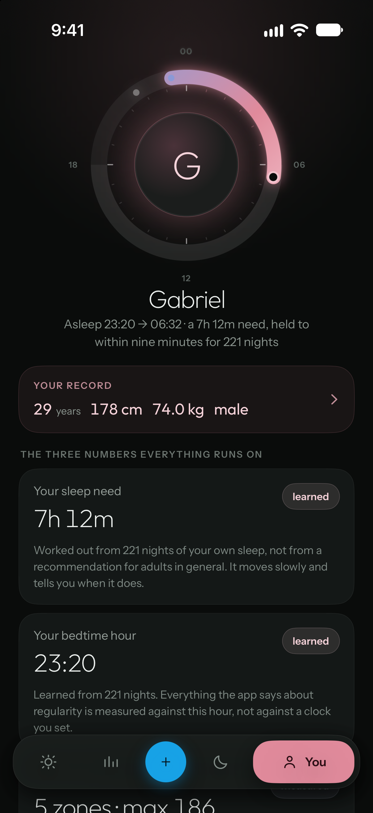
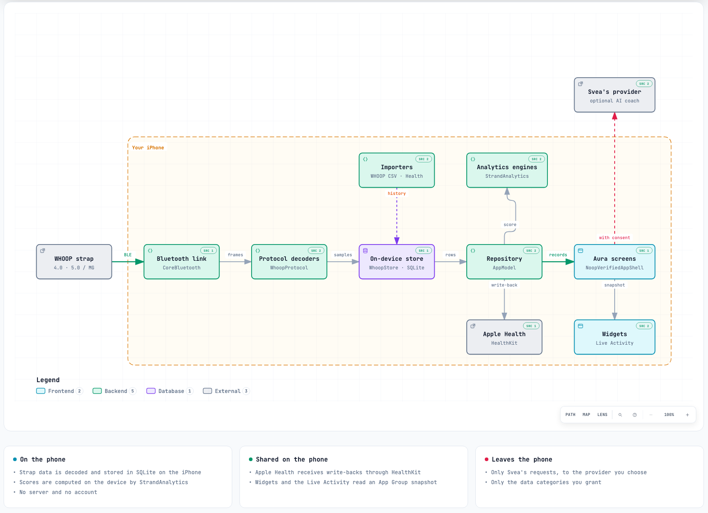

  

<h1 align="center">Noop Aura</h1>

<em>Your strap already knows how you slept. Noop Aura is where it tells you.</em>

<strong>11.7.0 experimental release · iPhone · not a medical device</strong>

---

Most health apps open on a verdict: a score, a colour, a judgement you did not ask for before
breakfast. Noop Aura opens on four slow breaths.

Then it shows you the night. How long you slept against the amount you planned for, where the deep
sleep fell, what your resting pulse and heart-rate variability did against *your own* normal rather
than a population chart. It does not round anything up to sound encouraging. When it has not seen
enough of your record to say something, it says so and waits, instead of filling the gap with a
confident guess.

That restraint is the whole idea. Every screen in Noop Aura was drawn first, as a complete interactive
prototype, and then built back against it at the same 402 × 874 points. The prototype is published here too, so you can hold the app up against its own blueprint.

## The same engine, a new cabin

Noop Aura is built on [RyanBR's NOOP](https://github.com/ryanbr/noop), the open companion that proved
a WHOOP strap can pair, record and be scored entirely on your own phone. That foundation is here, on
the NOOP 11.7 line: the Bluetooth link, the on-device database, and the analytics that turn raw
beats into sleep, effort and vital signs.

What Noop Aura adds is everything you look at and touch: a calmer iPhone interface organised around
your day and your night, one place to record any workout, a record of the things you do, and Svea, an
optional coach adapted from [DX's fork](https://github.com/DX23876/noop) that only ever talks to the
provider you choose, about the parts of your record you allow.

  
  
  
  

iOS Simulator captures of the 11.7 build with its built-in example person. On your phone, every figure comes from your own record, or is left blank until it can.

## A day with it

- **Morning.** Rest draws last night as a ring that closes at your sleep target, with the stages and
  running sleep debt behind it. Vitals set your resting heart rate, HRV, breathing rate and skin
  temperature against a band built from your own recent nights.
- **Through the day.** Today carries your live heart rate, and so does the Lock Screen. A single tap
  on + logs a coffee, a glass of water, a meal, a drink or a nap, so later patterns have something
  real to compare.
- **Training.** Start a ride, a walk or a lift from one place. Noop Aura keeps exactly one session
  running, survives the app being closed mid-workout, and writes the finished session to Apple Health.
  Lifting has its own programs, sets and history.
- **The long view.** Trends shows how your weeks are moving. *Your ages* turns resting pulse, HRV,
  cardio fitness, sleep regularity and daily movement into a Body Age, and shows which of them are
  pulling it which way.
- **Your data, your way.** Heart rate, sleep and workouts flow into Apple Health. A WHOOP data export
  can be imported to give the app your history from the first day.

Everything is stored and computed on the iPhone. There is no Noop Aura account, no server and no
telemetry.

## How it fits together

  <picture>
    <source media="(prefers-color-scheme: dark)" srcset="docs/aura/architecture/noop-aura-architecture-dark.png">
    
  </picture>

One reading, from the strap to the screen. Every box links to its source. For the interactive version, download <a href="docs/aura/architecture/noop-aura-architecture.html"><code>noop-aura-architecture.html</code></a> and open it in a browser.

## Try 11.7

Download the **[Noop Aura 11.7.0 experimental release](https://github.com/gdorgian/noop/releases/tag/v11.7.0-aura.1104)**
and read its notes before installing. The IPA is unsigned: sign it with your own Apple ID through a
sideloader such as AltStore or SideStore. It is not an App Store build. Keep a backup before changing
the app's identity or reinstalling, because a differently signed app does not inherit the old one's
database.

This release is **iPhone only**. For Android, use the [upstream project](https://github.com/ryanbr/noop).
Technical details are in the [iOS guide](docs/IOS.md) and the [build guide](docs/BUILD.md).

## See the blueprint

The complete [11.7 design handoff](docs/design/11.7/README.md) is public: interactive HTML for every
screen, specifications, measurements, route maps, decision notes and icon references. Start with its
README, then `notes/FOR ENGINEERING - Noop Aura 11.7 open items.txt`. The HTML is the visual and
interaction reference, not the app's code. The [design index](docs/design/README.md) also keeps the
earlier 9 September handoff and a screen-by-screen QA report for history.

## Build on it

Everything needed to continue is in this repository. The [development handoff](docs/aura/README.md)
collects the architecture map, the rules the release was built on, the open questions for design,
the last real-device test and the known problems. The [design-flip tool](Tools/design-flip/README.md)
compares any design screen with the app at 402 × 874. Bug reports and side-by-side screenshots are
welcome in [Issues](https://github.com/gdorgian/noop/issues).

## The fine print

Noop Aura 11.7 is an **experimental release, not a finished product**. Some screens need weeks of
history before they have anything to say. A few features still need work or real-device confirmation:
the strap alarm, setting a goal, and the Home Screen widgets. Intraday Charge is deliberately left
blank until the app has a sound way to calculate it, and it never passes off morning recovery as
Charge.

Its readings are estimates for general wellness, not diagnoses or medical advice. Noop Aura is
independent: it is not made, endorsed or supported by WHOOP. If you enable Svea, requests go to the
AI provider you configure, limited to the data categories you grant. See
[privacy and security](docs/PRIVACY_SECURITY.md), [attribution](ATTRIBUTION.md) and the
[license](LICENSE) for the precise boundaries.
